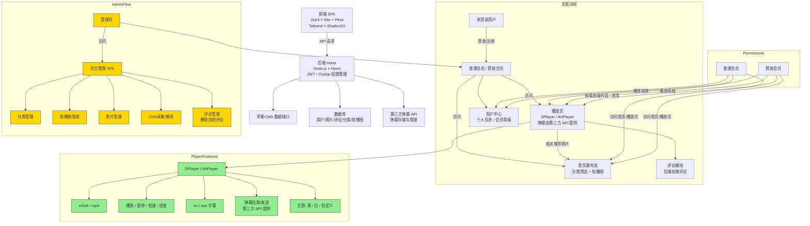

# 🎬 影视网站项目规划文档

## 1️⃣ 项目目标

构建一个完整的影视网站，支持：

- 苹果CMS采集与解析管理（仅管理员）
- 视频播放（m3u8 / mp4，支持弹幕、字幕、倍速播放、主题自定义）
- 用户管理（管理员、普通会员、赞助会员）
- SPA / PWA 前端，响应式 UI
- 后端高性能轻量框架

------

## 2️⃣ 技术栈

| 层级     | 技术                                 | 说明                                        |
| -------- | ------------------------------------ | ------------------------------------------- |
| 前端框架 | Vue 3 + Vite + Pinia + Vue Router    | SPA / PWA，快速开发，状态管理和路由控制     |
| UI 框架  | Tailwind CSS + Shadcn/UI             | 快速布局，美观 UI，响应式设计               |
| 播放器   | DPlayer                              | 支持 m3u8/mp4，弹幕、字幕、倍速、主题自定义 |
| 前端请求 | Fetch API                            | 与后端接口通信                              |
| 后端框架 | Node.js + Hono                       | 高性能轻量后端，兼容 Cloudflare Worker      |
| 用户鉴权 | JWT / Cookie                         | 用户登录状态、权限控制                      |
| 数据存储 | 数据库（Cloudflare D1）              | 用户、影片、弹幕、CMS数据存储               |
| CMS接口  | 苹果CMS API                          | 采集影片数据与解析播放链接                  |
| 部署平台 | Cloudflare Worker / Vercel / Netlify | 前后端部署                                  |
| 版本管理 | Git + GitHub                         | 项目管理与协作                              |

------

## 3️⃣ 系统架构



## 4️⃣ 用户角色 & 权限

| 角色     | 权限说明                                                     |
| -------- | ------------------------------------------------------------ |
| 管理员   | 后台管理 SPA、CMS采集与解析、分类管理、轮播图管理、影片管理、用户管理 |
| 普通会员 | 首页、播放页、用户中心、可观看普通影片                       |
| 赞助会员 | 普通会员权限 + 高清/高级影片、广告去除、额外功能             |

------

## 5️⃣ 功能模块

### 前端模块

1. **登录 / 注册页**：用户认证，JWT 登录
2. **首页瀑布流**：影片分类筛选、轮播图、推荐影片
3. **播放页**：播放器播放，支持弹幕、字幕、倍速、主题自定义
4. **用户中心**：显示个人信息、会员等级、修改密码
5. **后台管理 SPA（管理员）**：
   - 分类管理
   - 轮播图管理
   - 影片管理
   - CMS采集/解析管理

### 后端模块

1. **用户管理接口**：
   - 注册 / 登录 / 登出
   - 用户信息管理
   - 权限控制
2. **影片管理接口**：
   - 获取影片列表 / 新增 / 修改 / 删除
3. **CMS采集与解析接口**（仅管理员）：
   - 分类管理
   - 轮播图管理
   - 影片信息管理
   - 调用苹果CMS接口采集影片数据
   - 解析播放链接（m3u8 / mp4）
4. **弹幕接口**：
   - 发送 / 获取 / 存储弹幕

------

## 6️⃣ 页面规划

| 页面           | 角色                | 功能                                                 |
| -------------- | ------------------- | ---------------------------------------------------- |
| 登录 / 注册    | 所有用户            | 用户登录、注册                                       |
| 首页（瀑布流） | 所有用户            | 影片展示、分类筛选、轮播图                           |
| 播放页         | 所有用户            | 播放影片、弹幕、字幕、倍速、主题、用户评论、相关推荐 |
| 用户中心       | 普通会员 / 赞助会员 | 显示个人信息、会员等级                               |
| 后台管理 SPA   | 管理员              | 分类管理、轮播图管理、影片管理、CMS采集/解析         |
| 弹幕管理       | 所有用户            | 播放页弹幕发送 / 显示                                |

------

## 7️⃣ 开发路线建议

1. **前端基础搭建**
   - Vue 3 + Vite 项目初始化
   - Pinia 状态管理
   - Vue Router 页面路由
   - Tailwind + Shadcn/UI 布局
2. **后端基础搭建**
   - Hono 项目初始化
   - JWT / Cookie 用户鉴权
   - 数据库建表（用户、影片、弹幕、分类、轮播图）
   - 后端 API 接口框架搭建
3. **用户模块开发**
   - 注册 / 登录 / 用户信息管理
   - 前端路由守卫，权限控制
4. **影视模块开发**
   - 首页瀑布流 & 分类筛选
   - 播放页集成 DPlayer
   - 弹幕功能实现
   - 相关推荐影片
5. **后台管理开发**
   - 分类管理 / 轮播图管理 / 影片管理
   - CMS采集 / 播放链接解析接口
6. **优化与部署**
   - 响应式 UI 与 PWA 支持
   - 部署 Hono 后端到 Cloudflare Worker
   - 前端部署到 Vercel / Netlify
   - 测试会员权限和播放功能

🎬 数据库设计

## 1️⃣ 用户表 `users`

| 字段       | 类型         | 描述                               |
| ---------- | ------------ | ---------------------------------- |
| id         | BIGINT       | 主键，自增                         |
| username   | VARCHAR(50)  | 用户名（唯一）                     |
| password   | VARCHAR(255) | 加密密码                           |
| email      | VARCHAR(100) | 邮箱                               |
| avatar     | VARCHAR(255) | 用户头像                           |
| role       | ENUM         | 用户角色：`admin`, `normal`, `vip` |
| created_at | DATETIME     | 创建时间                           |
| updated_at | DATETIME     | 更新时间                           |

------

## 2️⃣ 分类表 `categories`

| 字段       | 类型        | 描述     |
| ---------- | ----------- | -------- |
| id         | BIGINT      | 主键     |
| name       | VARCHAR(50) | 分类名称 |
| created_at | DATETIME    | 创建时间 |
| updated_at | DATETIME    | 更新时间 |

------

## 3️⃣ 影片表 `films`

| 字段        | 类型         | 描述             |
| ----------- | ------------ | ---------------- |
| id          | BIGINT       | 主键             |
| title       | VARCHAR(255) | 影片标题         |
| category_id | BIGINT       | 分类ID           |
| cover       | VARCHAR(255) | 封面图           |
| description | TEXT         | 影片简介         |
| source_url  | VARCHAR(255) | 原始CMS链接      |
| play_url    | VARCHAR(255) | 解析后的播放链接 |
| created_at  | DATETIME     | 创建时间         |
| updated_at  | DATETIME     | 更新时间         |

------

## 4️⃣ 轮播图表 `banners`

| 字段       | 类型         | 描述         |
| ---------- | ------------ | ------------ |
| id         | BIGINT       | 主键         |
| title      | VARCHAR(255) | 标题         |
| image_url  | VARCHAR(255) | 图片地址     |
| link       | VARCHAR(255) | 点击跳转链接 |
| created_at | DATETIME     | 创建时间     |
| updated_at | DATETIME     | 更新时间     |

------

## 5️⃣ 评论表 `comments`

| 字段       | 类型     | 描述                |
| ---------- | -------- | ------------------- |
| id         | BIGINT   | 主键                |
| film_id    | BIGINT   | 影片ID              |
| user_id    | BIGINT   | 用户ID              |
| content    | TEXT     | 评论内容            |
| likes      | INT      | 点赞数              |
| status     | TINYINT  | 状态：0正常 / 1删除 |
| created_at | DATETIME | 创建时间            |
| updated_at | DATETIME | 更新时间            |

------

## 6️⃣ CMS采集日志表 `cms_logs`

| 字段       | 类型        | 描述                      |
| ---------- | ----------- | ------------------------- |
| id         | BIGINT      | 主键                      |
| action     | VARCHAR(50) | 操作类型：collect / parse |
| film_id    | BIGINT      | 关联影片ID                |
| result     | TEXT        | 采集或解析结果            |
| created_at | DATETIME    | 时间                      |

🏗️ 项目结构
```
project-root/
│
├─ frontend/                 
│   ├─ src/
│   │   ├─ assets/
│   │   ├─ components/
│   │   ├─ views/
│   │   ├─ router/
│   │   ├─ store/
│   │   └─ App.vue
│   └─ vite.config.ts
│
├─ backend/                  
│   ├─ controllers/
│   │   ├─ userController.ts
│   │   ├─ filmController.ts
│   │   ├─ commentController.ts
│   │   ├─ cmsController.ts
│   │   └─ danmakuController.ts
│   ├─ middlewares/
│   │   ├─ auth.ts
│   │   └─ logger.ts
│   ├─ models/
│   │   ├─ user.ts
│   │   ├─ film.ts
│   │   ├─ category.ts
│   │   ├─ comment.ts
│   │   └─ banner.ts
│   ├─ routes/
│   │   ├─ userRoutes.ts
│   │   ├─ filmRoutes.ts
│   │   ├─ commentRoutes.ts
│   │   └─ cmsRoutes.ts
│   ├─ utils/
│   │   ├─ db.ts
│   │   └─ cache.ts      # KV 缓存工具
│   └─ app.ts
│
├─ database/
│   └─ migrations/
├─ public/
├─ package.json
└─ README.md

```

